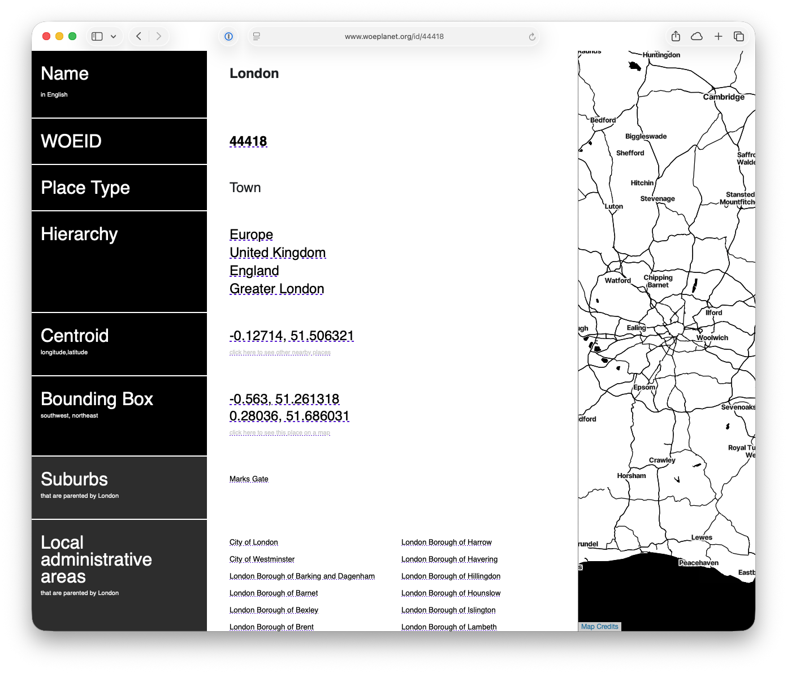

# &nbsp;woeplanet-spelunker

A Python web application for querying and browsing [WhereOnEarth](https://en.wikipedia.org/wiki/Whereonearth) (WOE) geographic data. **WOE**planet is a searchable and linkable index of every single [WOEID](https://en.wikipedia.org/wiki/WOEID) published, derived from the Creative Commons licensed Yahoo! GeoPlanet data dumps.

## tl;dr



## The Short Version

WOEplanet is Where On Earth (AKA WOE, also AKA GeoPlanet) data, smushed up with coordinate and boundary data from Flickr Shapes, Quattroshapes and Natural Earth Data (that's fancy talk for _polygons_) as well as concordances and other metadata rescued from `woe.spum.org` before it died and went offline.

The WOEplanet Spelunker is a [Starlette](https://starlette.dev/) based web app, hosted at [`woeplanet.org](https://woeplanet.org) for visualising, poking into and searching the WOEplanet data.

This Spelunker is a spiritual successor to [woedb](https://web.archive.org/web/20180308192417/http://woe.spum.org/) by [Aaron Straup Cope](https://www.aaronland.info/weblog/2010/04/05/milkshake/#woedb), and draws inspiration from the [Who's On First Spelunker](https://spelunker.whosonfirst.org/).

### Step 1: Get the WOEplanet databases

Download the WOEplanet SQLite databases (main database and geometry database) from the [WOEplanet data releases](https://www.woeplanet.org/data); these are provided as per place type SQLite databases and SpatiaLite databases for the geometries.

### Step 2: Set up the environment

Copy [`.env.template](./.env.template) to `.env` (it should work as is).

### Step 3: Setup the databases

Put the downloaded, still compressed, databases in `$WOEPLANET_DOWNLOADS_DIR`.

Use the [helper script](https://github.com/woeplanet/woeplanet-build/blob/master/scripts/merge_dbs.py) in the [woeplanet-build](https://github.com/woeplanet/woeplanet-build) repo to combine the per place type databases into a single places database and a single geometries database and put these in `$WOEPLANET_STORAGE_DIR`.

### Step 4: Run with Docker

Use the provided [`docker-compose.yml`](./docker-compose.yml) file, adjusting it to your needs and setup.

```bash
docker compose up -d
```

That's it. Point your web browser at `http://localhost:8080` and happy spelunking.
